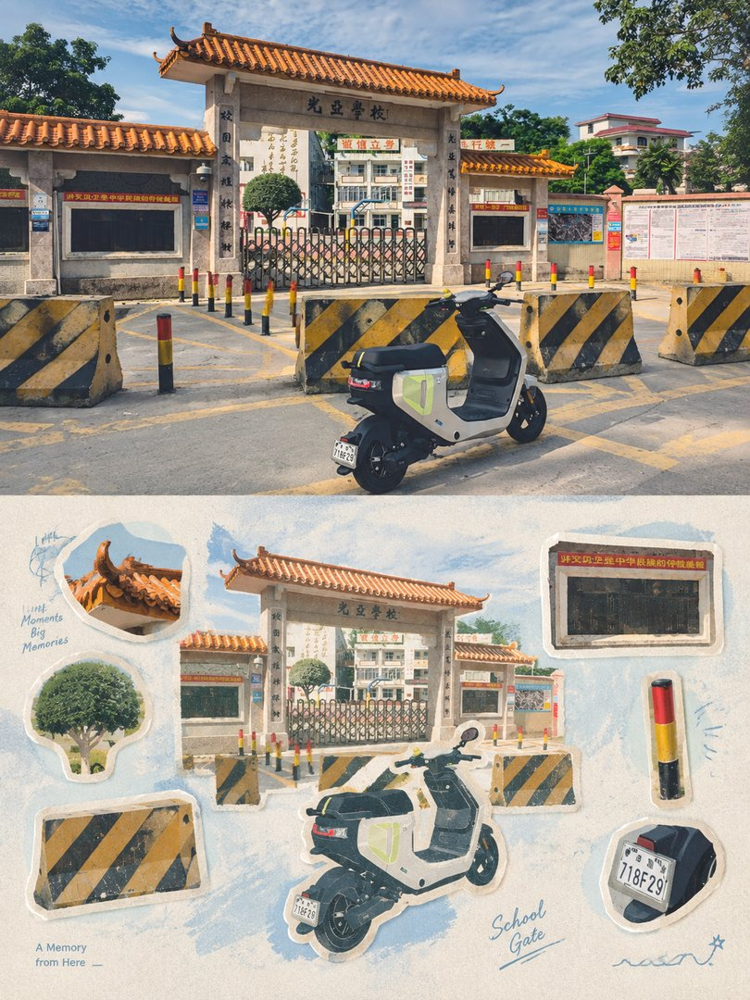
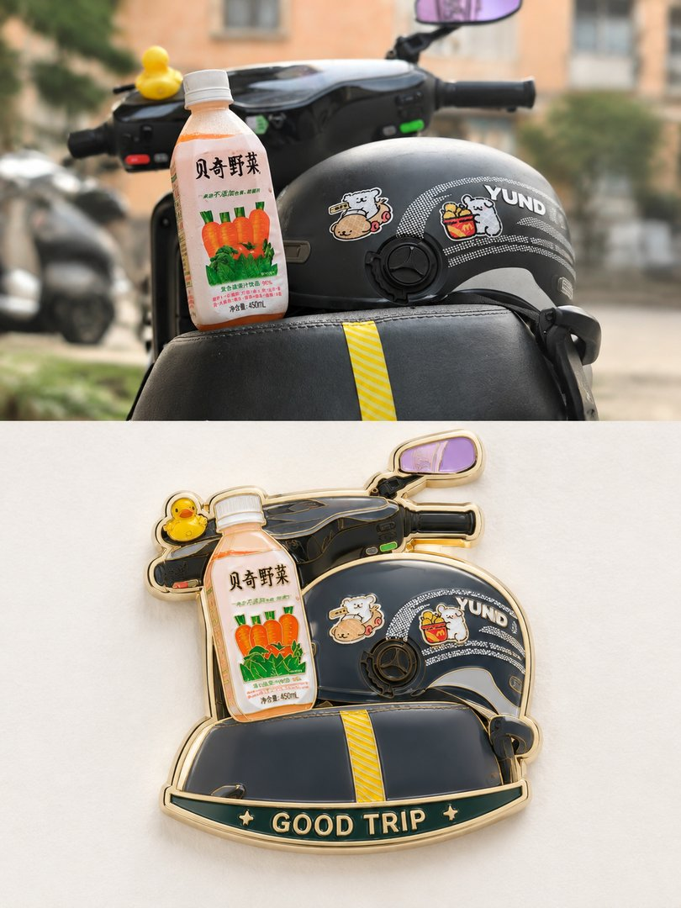
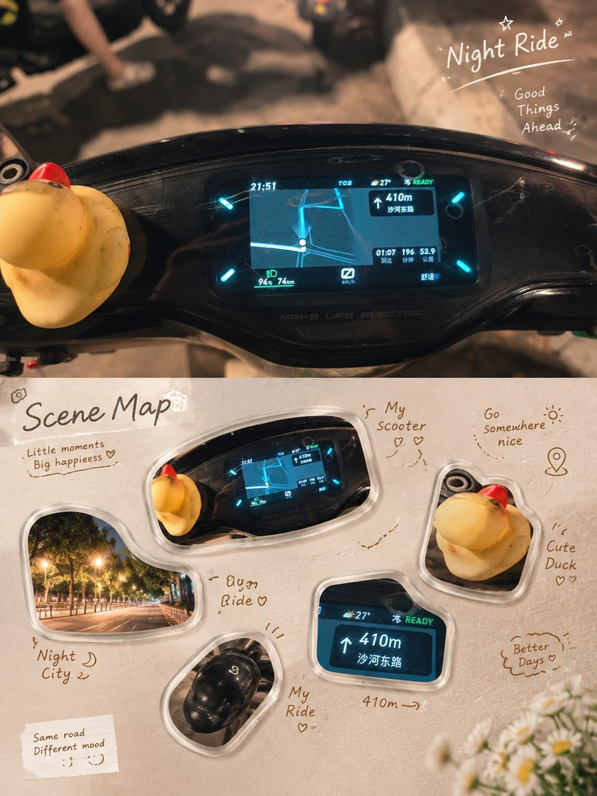
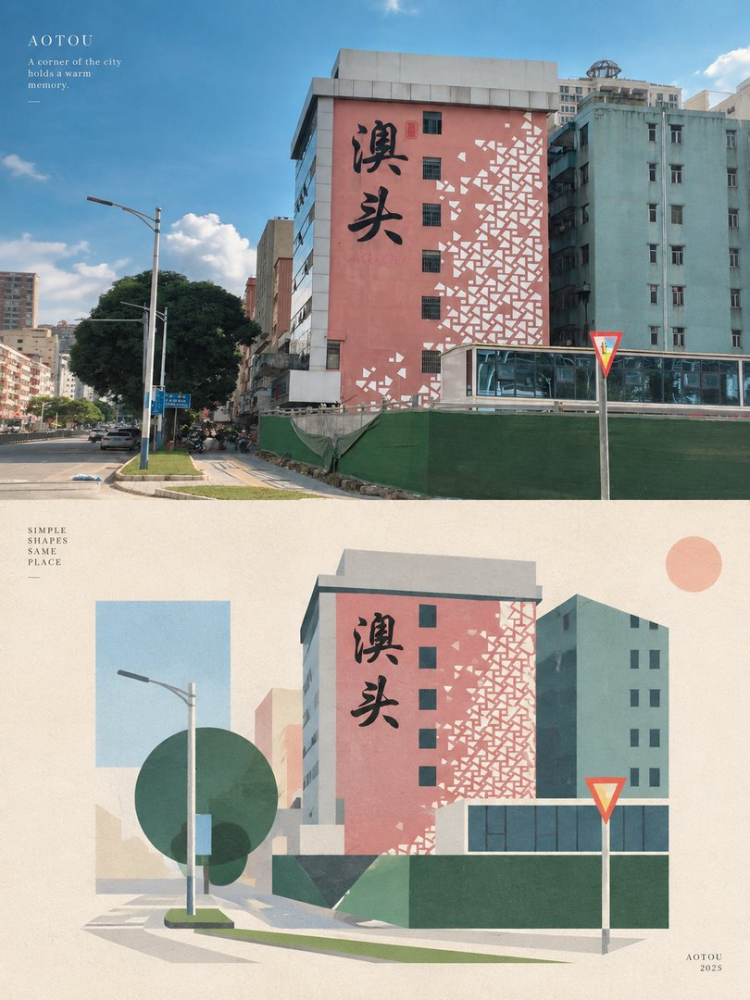
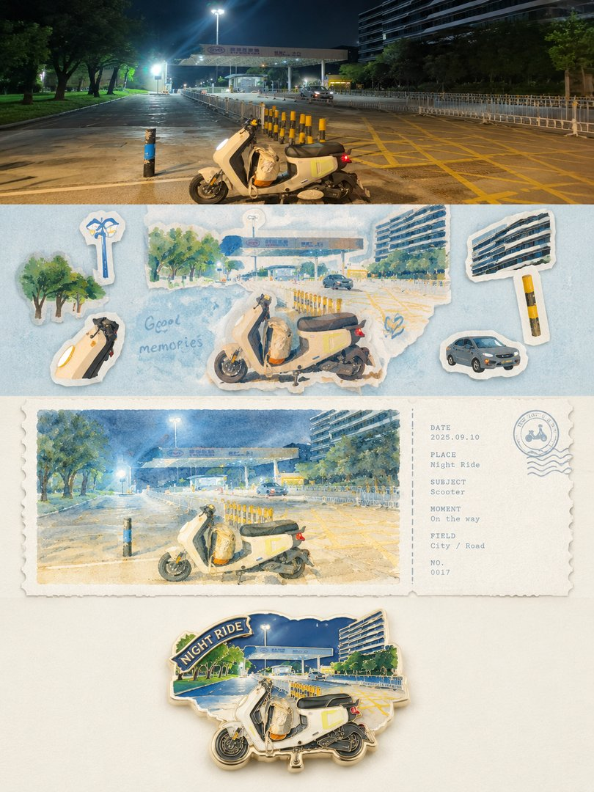
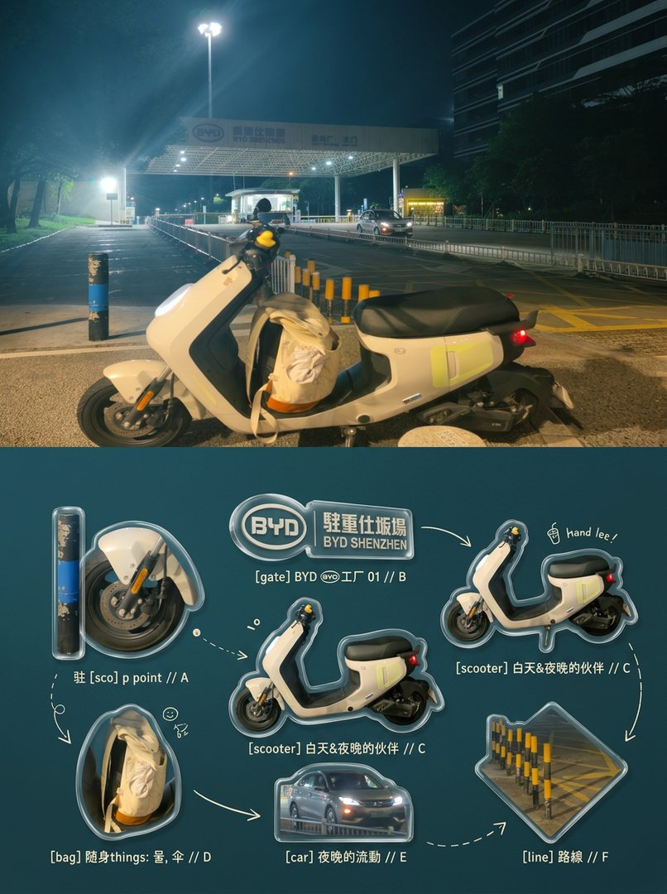

# 旅行照片配图（travel-photo-styling）

把旅行照片一键变成高级设计海报：贴纸收藏页、水彩票根、珐琅徽章、亚克力图鉴、几何解构、字体海报……9 套实战迭代的风格模板 + 支持任意生图 API 的批量生成 CLI。

**零依赖**（Python 3.8+ 标准库）、**模板即插即用**（不绑定工具，直接粘贴到 ChatGPT/即梦/豆包也能用）、**API 可扩展**（内置 Imagifly 与 OpenAI 兼容接口，任意自建服务纯配置接入）。

## 效果一览

以下全部由本仓库模板真实生成（同一张照片 → 多种风格转译，上=原图，下=AI 重构）：

| 四层风格转译 | 记忆贴纸 | 水彩票根 |
|:---:|:---:|:---:|
|  |  |  |

| 珐琅徽章 | 亚克力 SceneMap | 几何解构 |
|:---:|:---:|:---:|
|  |  |  |

| 字体图像化 | 四层·夜景 | 亚克力·夜景 |
|:---:|:---:|:---:|
|  |  |  |

更多风格细节与「照片类型 → 风格」适配矩阵见 [prompts/风格速查表.md](prompts/风格速查表.md)。

## 它是怎么工作的

```
你的照片 ──┐
           ├──> 提示词模板（prompts/）──> 队列（prompts.txt）──> Provider ──> 任意生图 API
默认配置 ──┘                                                        ↑
                                              imagifly / openai_compat / 自定义（纯配置）
```

1. **选模板**：`prompts/` 里挑一套风格（或自己写）
2. **入队**：`python main.py --render i2i/03a_记忆贴纸_单层_I2I.txt --img 照片.jpg --add`
3. **预检**：`--validate / --estimate / --dry-run`（不调 API、不花钱）
4. **跑**：`python main.py`，产物落 `images/`，成功移入 `done.txt`，失败留 `failed.jsonl` 可重试

## 安装

```bash
git clone https://github.com/shaozheng0503/travel-photo-styling.git
cd travel-photo-styling
python main.py --list-providers   # 确认环境 OK
```

无需 `pip install` 任何东西。

## 快速开始

### 1. 配置生图服务（三选一）

**A. Imagifly（默认，开箱即用）**

```bash
# 登录 https://imagifly.net → F12 → Network → 复制任意请求的 Cookie 整行
cp config/cookie.txt.example config/cookie.txt   # 粘贴进去
python main.py --check                           # 验证登录态
```

**B. OpenAI 兼容 API（OpenAI 官方 / DashScope / SiliconFlow / one-api 中转等）**

编辑 `config/providers.json` 的 `openai_compat` 段（或设 `OPENAI_API_KEY` 环境变量）：

```json
"openai_compat": {
  "api_key": "sk-xxx",
  "base_url": "https://api.openai.com/v1",
  "models": {"gpt-image-1": {"ref": 1, "cost": null}}
}
```

**C. 任意其他 API（纯配置，不写代码）**

抄 `config/providers.json` 里的 `myapi` 段改一改，支持三种响应模式：
- `sync_url`：POST 直接返回图片 URL（最常见）
- `sync_b64`：POST 直接返回 base64
- `poll_task`：POST 返回 task_id → 轮询另一端点

URL / Header / Body 全部支持 `{prompt} {model} {ratio} {api_key} {id}` 等占位符模板。

### 2. 生成第一张

```bash
# 图生图：照片 → 贴纸收藏页
python main.py --render i2i/03a_记忆贴纸_单层_I2I.txt --img 你的照片.jpg --add
python main.py --validate    # 校验
python main.py               # 生成（高成本模型需 --confirm）

# 文生图：用 --var 填占位符
python main.py --render t2i/01_手绘旅行海报_T2I.txt --var COUNTRY=日本 --add
python main.py --render t2i/02_冰棒微缩城市_T2I.txt --var CITY=东京 --var LANDMARK=东京塔 --var LOCAL_BUILDING=晴空塔 --add
python main.py
```

T2I 占位符：01 用 `[COUNTRY]`；02 用 `[CITY]` `[LANDMARK]` `[LOCAL_BUILDING]`，漏填会在渲染时提醒。

### 3. 批量玩法

`prompts.txt` 每行一条任务，`|` 后跟内联参数：

```
<模板渲染后的长提示词> | model=gpt-image-2 | 3:4 | img=/path/to/photo1.jpg
<模板渲染后的长提示词> | model=nano-banana-2 | 3:4 | img=/path/to/photo2.jpg
一张赛博朋克猫 | model=Wai-SDXL | 1:1 | x4
```

| 内联参数 | 说明 |
|---|---|
| `model=` | 模型名（`--list-models` 查看） |
| `provider=` | 生图服务（imagifly / openai_compat / 自定义段名） |
| `3:4` 等 | 宽高比 |
| `x2`~`x4` | 每条生成数量 |
| `img=` | 参考图路径（逗号分隔多张） |
| `style=` / `neg=` / `steps=` / `tier=` | 风格 / 负面词 / 步数 / 分辨率档 |

## CLI 命令速查

```bash
python main.py --list-providers   # 可用生图服务
python main.py --list-models      # 当前服务的模型清单
python main.py --check            # 配置/登录态自检
python main.py --render <模板> --img <照片> --add   # 模板 → 队列
python main.py --validate         # 校验队列（不调 API）
python main.py --estimate         # 估算成本（不调 API）
python main.py --dry-run          # 解析预演（不调 API）
python main.py                    # 跑全部队列
python main.py 3                  # 只跑前 3 条
python main.py --confirm          # 跑高成本任务（≥5 成本单位）
python main.py --retry-failed     # 失败任务一键重入队
python main.py --summary          # 汇总结果
python tests/test_offline.py      # 离线单测（34 用例，不花钱）
```

## 接入你自己的生图 API

### 方式一：纯配置（推荐，不用写代码）

`config/providers.json` 加一段：

```json
"my-service": {
  "type": "generic",
  "api_key": "sk-xxx",
  "models": {"my-model": {"ref": 1, "cost": 1}},
  "templates": {
    "submit": {
      "method": "POST",
      "url": "https://api.example.com/generate",
      "headers": {"Authorization": "Bearer {api_key}"},
      "body_json": {"model": "{model}", "prompt": "{prompt}", "size": "{ratio}"}
    },
    "poll": {
      "method": "GET",
      "url": "https://api.example.com/tasks/{id}",
      "headers": {"Authorization": "Bearer {api_key}"}
    }
  },
  "response": {"mode": "sync_url", "url_key": "data.0.url"}
}
```

然后队列里用 `provider=my-service`，或 `config/config.json` 里把 `"provider"` 改成 `"my-service"` 设为默认。

占位符：`{prompt} {model} {ratio} {batch} {style} {images_json} {api_key} {id} {nonce} {timestamp}`

### 方式二：写一个 Provider 类（约 30 行）

```python
# providers/my_provider.py
from providers.base import ImageProvider

class MyProvider(ImageProvider):
    name = "my_provider"
    def submit(self, job, model, ratio, batch, style): ...
    def poll(self, handle, job=None, timeout=600, interval=2): ...
    def download(self, asset, dest_dir, prompt, idx, kind="image"): ...

def register(registry):
    registry["my_provider"] = MyProvider
```

在 `providers/__init__.py` 的 `BUILTIN_PROVIDERS` 里加上 `"my_provider"` 即可。详见 `providers/base.py` 的接口约定。

## 提示词模板从哪来

`prompts/` 的 9 套模板全部经过真实生成的多轮迭代——每条「防翻车条款」（禁裁切、贴纸去重、地名逐字复用、日期季节化）背后都是一次真实的翻车。使用说明见 [prompts/README.md](prompts/README.md)。

模板是纯文本，你可以：
- 直接用 CLI `--render` 入队（T2I 模板配合 `--var` 填占位符）
- 粘贴到任何生图产品（ChatGPT、即梦、豆包……）配合照片使用
- 手动替换 `[COUNTRY]` `[CITY]` 等占位符适配你的场景

[English documentation](README_EN.md)

## 目录结构

```
travel-photo-styling/
├── main.py                  # CLI 入口
├── core/                    # HTTP / 队列 / 工具（零依赖）
│   ├── http.py              #   SSL 回退、UA、魔数校验
│   ├── queue.py             #   行解析、断点续跑、失败重入队
│   └── utils.py             #   slug、单行化
├── providers/               # 生图服务接入层
│   ├── base.py              #   ImageProvider 抽象类
│   ├── imagifly.py          #   Imagifly（内置，实战迁移）
│   ├── openai_compat.py     #   OpenAI 兼容 API
│   └── generic.py           #   纯配置接入任意 API
├── prompts/                 # 提示词技能库
│   ├── t2i/                 #   文生图 ×2
│   ├── i2i/                 #   图生图 ×7
│   ├── 风格速查表.md         #   照片类型 → 风格适配矩阵
│   └── README.md            #   使用说明
├── config/
│   ├── config.json          #   默认 provider / 模型 / 比例
│   ├── providers.json       #   自定义服务接入配置（含示例）
│   └── cookie.txt.example   #   Imagifly cookie 模板
├── docs/images/             # README 效果图
└── tests/test_offline.py    # 离线单测（34 用例）
```

## 常见问题

**Q: 一定要用 Imagifly 吗？**
不。Imagifly 只是默认内置；OpenAI 兼容 API 改一行配置，其他服务抄 `myapi` 模板段落配置即可。提示词模板本身不绑定任何平台。

**Q: 会误花钱吗？**
`--validate / --estimate / --dry-run` 全部零成本；单条任务成本 ≥5（平台口径）会阻断，必须 `--confirm` 才跑。

**Q: Cookie / API Key 会泄露吗？**
不会。`config/cookie.txt` 和 `providers.local.json` 都在 `.gitignore` 里；`providers.json` 里别填真实密钥，用环境变量或本地文件。

**Q: 中途断了怎么办？**
成功一条移出 `done.txt` 一条（原子写），断点续跑直接重跑；失败的进 `failed.jsonl`，`--retry-failed` 一键重入队。

**Q: 模板在别的工具里效果打折吗？**
模板是通用提示词，但「原图在上 + 风格在下」的上下结构对模型的指令遵循要求较高，GPT-Image 系与 Nano-Banana 系实测最稳；弱模型可能结构跑偏。

## 许可证

[MIT](LICENSE) — 模板和代码随便用，欢迎衍生创作。

生成效果受所用模型与平台影响，本仓库只提供模板与工具，不担保任何平台的可用性。
